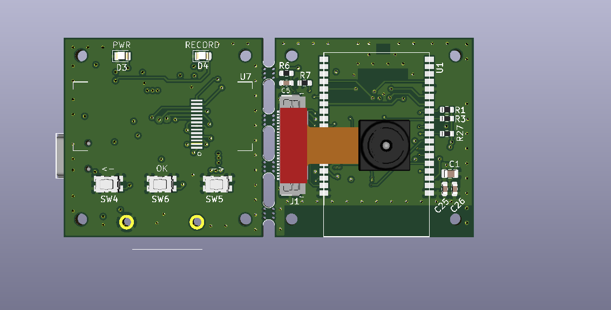

# DASHCAM PROJECT

This is the development repo for a low-cost, dash-cam hobby project.

Features:

1. Small size (34 x 34 x 34 cm)

2. Saves videos to AVI format (motion JPEG).

3. Powered through a USB mini cable.

4. Can connect to WiFi. The idea is to connect it to your phone hotspot, after which the video will be streamed to a local server that the driver can access on their phone's internet browser. This is to help the driver position the camera by seeing what the camera is seing.

5. Small OLED screen and 3 buttons for the UI. OLED will show the device IP address for the video streaming server, and show nearby WiFi access points.

6. Inexpensive looking (due to very small design). Will not encourage thieves!

7. Has a supercapacitor which keeps power active for ~ 1 second after power is cut, this means videos will never be corrupt.

8. SD card slot which overrides oldest videos, so the device will never run out of memory. 

9. It's a cube! The x, y and z dimentions have been distributed equally so it takes up as little space from the driver's perspective as possible.

## Latest update:

**Proven concepts**

- Videos can be saved on an ESP32 using an AVI format.

- Supercapacitor keeps the device on long enough for the video to save after abrupt power down.

- OLED library allows scrolling text, so long messages, i.e. IP address of device can be shown easily. 

**Hardware**

PCB spin 1 has arrived and components have been soldered.

The ESP32 can be programmed and can run a basic "hello world" script without issues.

Full circuit could not be tested because the 0.5 mm pitch FPC connectors proved difficult to solder without a hot air gun.

More details can be found in [Project_planning.xlsx](https://github.com/jhancharler/dashcam/blob/master/project_plan/Project_planning.xlsx "Project_planning.xlsx").

## Images:


**Top-side images:**



**Back images:**


**Upright images:**


**In-car concept**


**PCB view** 

*KiCAD files for the project can be found [here](https://github.com/jhancharler/dashcam/tree/master/hardware/schem_1)):
*

## Progress log

To see the progress log and design decisions, go to the /project_plan folder to see the various plan documents.

## Installation

Will be added once firmware is written for device.

```bash
```

## Usage

Will be added once firmware is written for device.

```python
```

## License
[MIT](https://choosealicense.com/licenses/mit/)